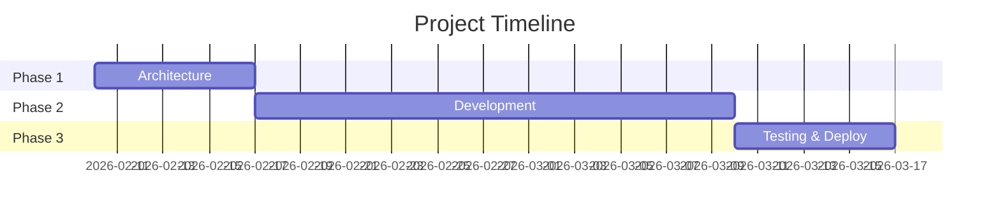
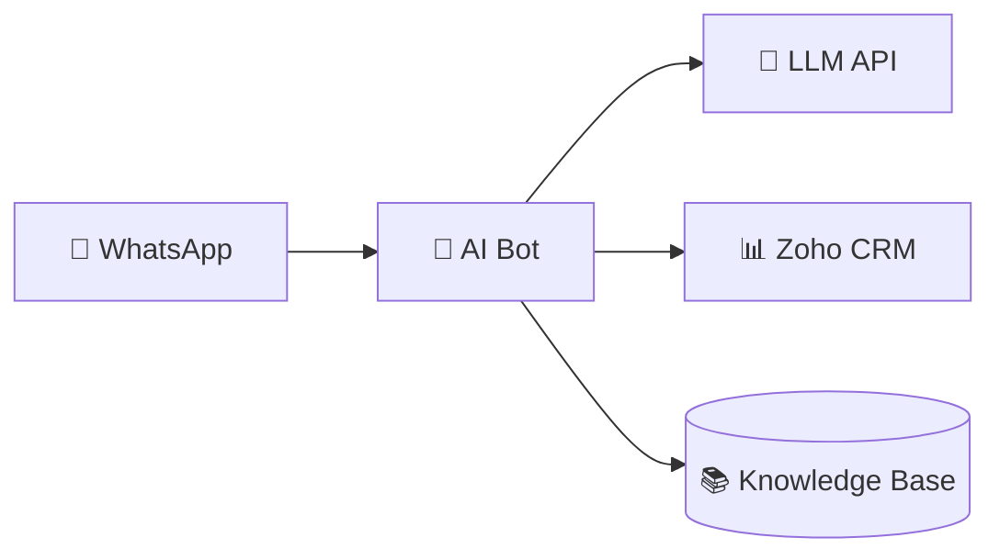
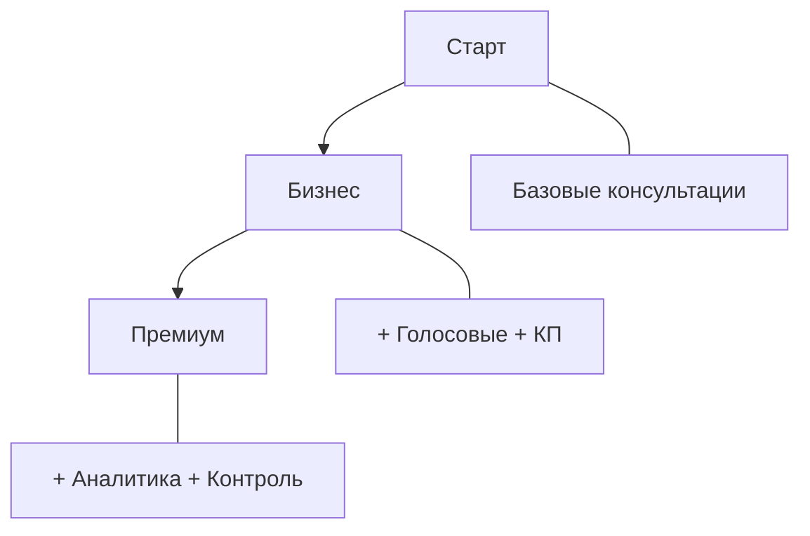

# Offer

Generate commercial proposals for IT projects. The skill provides a framework — the model thinks about specifics (team, benefits, risks) for each unique project.

## Output

**File**: `docs/offers/{project-slug}.md`

Example: `docs/offers/treejar-ai-sales-bot.md`

## When to Use

- Creating commercial proposals for client projects
- Generating estimates for any IT project (web, mobile, AI, integrations, etc.)
- Building multi-package pricing structures
- Documenting project scope with timeline

## Core Principle

**DO NOT use rigid templates.** Each project is unique. The model should:
- Analyze the project requirements
- Think about what team composition fits THIS project
- Generate benefits relevant to THIS client's business
- Identify risks specific to THIS tech stack and integrations

## Instructions

### Step 1: Understand the Project

Gather from user:
- Project name and description
- Target audience / client business
- Key features and integrations
- Budget constraints (if any)

### Step 2: Design Packages

Create 2-4 pricing packages (e.g., MVP → Business → Enterprise):
- Each package builds on the previous
- Define modules with hour estimates
- Think: what makes sense for THIS project?

### Step 3: Calculate Costs

For each package:
- Sum module hours
- Apply hourly rate (ask user or use default ~1500 ₽/h)
- Estimate timeline based on team size

### Step 4: Generate Business Benefits

**Think fresh for each project.** Consider:
- What problems does this solve for the client?
- What's the ROI / payback potential?
- How does each package level add value?
- What competitive advantages does it provide?

Write 4-5 compelling benefits per package in business language.

### Step 5: Compose the Team

**Think about what THIS project needs:**
- What roles are required? (Backend, Frontend, DevOps, QA, PM, Designer, etc.)
- What seniority levels?
- How many hours per role?

Don't use a fixed template — a simple API integration doesn't need the same team as a complex AI platform.

### Step 6: Identify Risks

**Analyze THIS project's specific risks:**
- What integrations might be problematic?
- What are the technical unknowns?
- What depends on the client?
- What could affect timeline?

Include mitigation strategies for each risk.

### Step 7: Add Operating Costs (if applicable)

For projects with ongoing costs (LLM APIs, hosting, SaaS):
- Load current pricing from `data/llm-models.json`
- Calculate monthly costs for different usage scenarios
- Provide recommendations

### Step 8: Create Mermaid Diagrams

Include visual diagrams to make the offer more compelling:

#### Timeline (Gantt)


#### System Architecture (for complex projects)


#### Package Comparison (optional)


### Step 9: Assemble & Save Document

Generate beautiful markdown with sections:

```markdown
# Коммерческое предложение: {Project Name}

**Дата:** {date}
**Версия:** 1.0

---

## О проекте
{description}

---

## Архитектура решения
{mermaid architecture diagram}

---

## Пакеты услуг

### Пакет "Старт" — {subtitle}
{table with modules and hours}

**Результат:** {what client gets}

**Выгода для бизнеса:**
- **{benefit 1}** — {description}
- **{benefit 2}** — {description}
...

**Стоимость:** {price} ₽
**Срок:** {weeks} недель

---

## Сравнение пакетов
{comparison table with ✓/—}

---

## Команда проекта
{table: Role | Responsibilities | Hours | Rate | Sum}

---

## Timeline
{mermaid gantt diagram}

---

## Ежемесячные расходы (if applicable)
{infrastructure + LLM costs table}

---

## Риски и митигация
{table: Risk | Probability | Impact | Mitigation}

---

## Что не входит
- {exclusion 1}
- {exclusion 2}

---

## Гарантии
- {guarantee 1}
- {guarantee 2}

---

## Следующие шаги
1. {step 1}
2. {step 2}
3. {step 3}

---

*Предложение действительно 14 дней.*
```

**Save to**: `docs/offers/{project-slug}.md`

## Reference Data

### LLM Models (for AI projects)

Load from `data/llm-models.json` — contains current OpenRouter pricing for:
- DeepSeek V3.2 (recommended for cost efficiency)
- Gemini 2.5 Flash
- Kimi K2
- GPT-4.1 / GPT-4.1-mini
- Claude 4 Sonnet
- Xiaomi MiMo-V2-Flash

## Examples

### Example 1: AI Sales Bot

**Input**: "AI bot for WhatsApp sales automation, furniture store, Arabic/English"

**Model thinks**:
- Team: Architect, Backend (LLM integration), DevOps
- Benefits: 24/7 availability, instant responses, multilingual support, CRM integration
- Risks: WhatsApp API changes, LLM quality for Arabic, voice message handling
- Packages: Basic (text only) → Business (voice + proposals) → Premium (analytics)
- Diagrams: Architecture (WhatsApp → Bot → LLM → CRM), Gantt timeline

**Saves to**: `docs/offers/treejar-ai-sales-bot.md`

### Example 2: E-commerce Platform

**Input**: "Online store with AI recommendations, 10K products"

**Model thinks**:
- Team: Backend, Frontend, DevOps, QA, Designer
- Benefits: Increased average order, personalization, inventory optimization
- Risks: Data migration, recommendation quality, performance at scale
- Packages: MVP (catalog + cart) → Growth (recommendations) → Enterprise (full analytics)
- Diagrams: Architecture (Frontend → API → DB → ML), Package flow

**Saves to**: `docs/offers/ecommerce-ai-recommendations.md`

### Example 3: Simple API Integration

**Input**: "Connect CRM with accounting system"

**Model thinks**:
- Team: Backend developer only, maybe part-time QA
- Benefits: No manual data entry, real-time sync, error reduction
- Risks: API limitations, data format mismatches
- Packages: Maybe just one package — it's a simple project
- Diagrams: Simple flowchart (CRM ↔ Integration ↔ Accounting)

**Saves to**: `docs/offers/crm-accounting-integration.md`

## Validation

- [ ] Project understood correctly
- [ ] Packages make sense for this project type
- [ ] Benefits are specific to client's business (not generic)
- [ ] Team composition fits the project scope
- [ ] Risks are relevant to the tech stack
- [ ] Calculations are correct
- [ ] Mermaid diagrams render correctly
- [ ] Document saved to `docs/offers/`
- [ ] Document is complete and professional

## Anti-Patterns

**DON'T:**
- Copy-paste same benefits for every project
- Use identical team for all projects
- List generic risks that don't apply
- Over-engineer simple projects
- Under-scope complex projects
- Skip diagrams — they add huge value

**DO:**
- Think fresh about each project
- Adapt structure to project complexity
- Write benefits in client's business language
- Be honest about risks and uncertainties
- Include relevant Mermaid diagrams
- Save the file automatically
