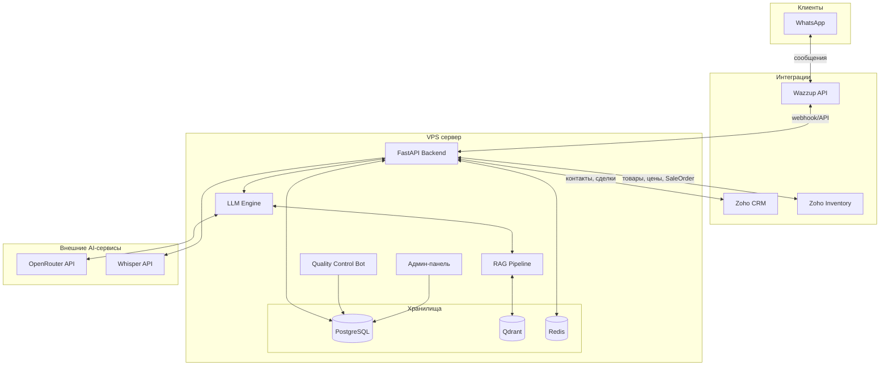
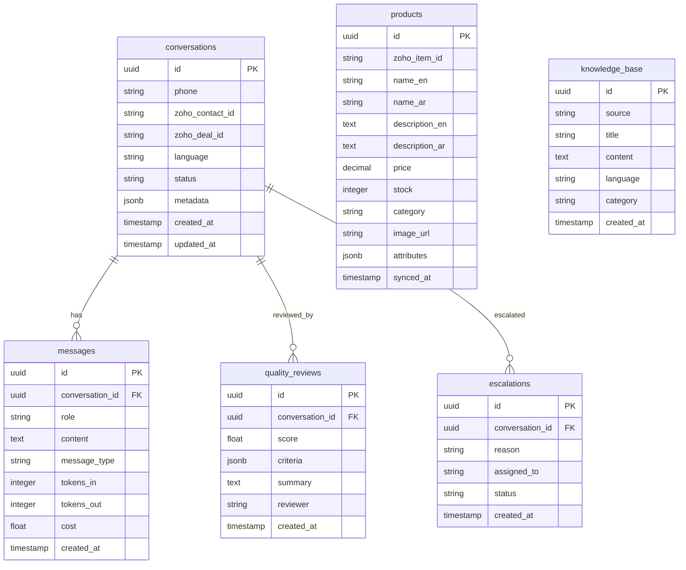
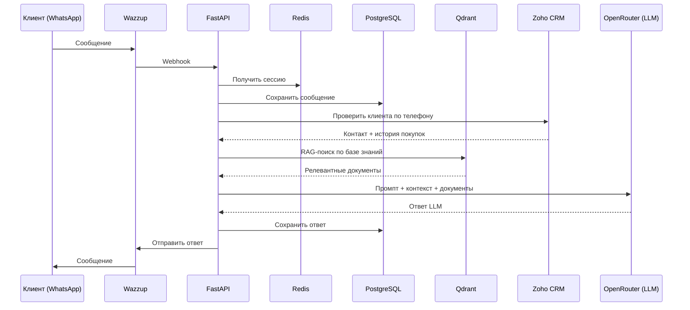
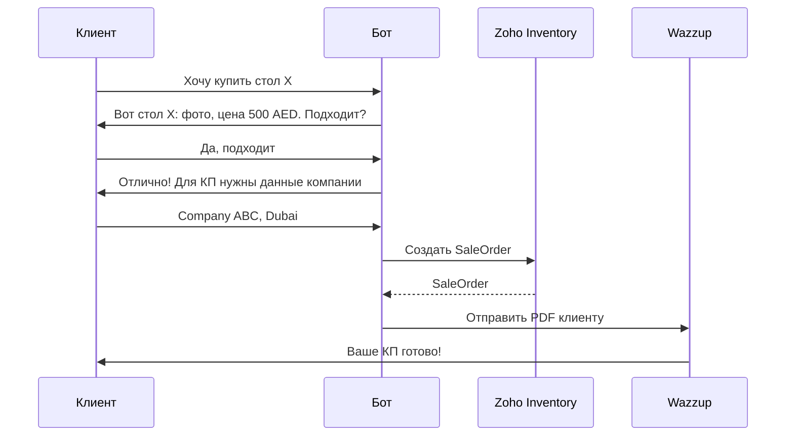

# Архитектура системы: ИИ-продавец Treejar

**Версия:** 1.0
**Дата:** 2026-02-04

---

## Общая схема



---

## Стек технологий

| Компонент | Технология | Версия | Обоснование |
|-----------|------------|--------|-------------|
| **Язык** | Python | 3.12+ | Лучшая экосистема для LLM/AI |
| **Фреймворк** | FastAPI | 0.110+ | Async, быстрый, типизированный |
| **ORM** | SQLAlchemy | 2.0+ | Стандарт для Python |
| **Миграции** | Alembic | 1.13+ | Версионирование схемы БД |
| **БД** | PostgreSQL | 16 | Надёжная, бесплатная |
| **Векторная БД** | Qdrant | 1.9+ | Self-hosted, быстрый поиск |
| **Кеш/очереди** | Redis | 7+ | Сессии, rate limiting, очереди |
| **LLM** | OpenRouter / DeepSeek API | — | OpenRouter как маршрутизатор / DeepSeek прямой API |
| **Голос** | Whisper (OpenAI) | — | Распознавание EN/AR |
| **Контейнеризация** | Docker + Compose | — | Изоляция, воспроизводимость |
| **CI/CD** | GitHub Actions | — | Автодеплой из git клиента |

---

## Сервер и инфраструктура

### VPS

| Параметр | Значение |
|----------|----------|
| **CPU** | 4 ядра |
| **RAM** | 8 GB |
| **Диск** | 80 GB SSD |
| **ОС** | Ubuntu 24.04 LTS |
| **Расположение** | Европа (Германия) |
| **Провайдер** | Hetzner (Ожидается выделенный независимый VPS. Пока предоставлен рабочий: 136.243.71.213) |
| **Стоимость** | ~$10-15/мес (Ожидается) |

### Что запущено на сервере

```
VPS (4 CPU, 8 GB RAM, 80 GB SSD)
├── Docker Compose
│   ├── app (FastAPI) — порт 8000
│   ├── postgres — порт 5432
│   ├── qdrant — порт 6333
│   ├── redis — порт 6379
│   ├── admin (React/Next.js) — порт 3000
│   └── nginx (reverse proxy) — порт 80/443
```

---

## Схема базы данных (PostgreSQL)



---

## Векторная база (Qdrant)

| Коллекция | Содержимое | Размер вектора |
|-----------|------------|----------------|
| `products` | Описания товаров (EN + AR) | 1024 (Jina v3) |
| `knowledge` | Правила диалогов, преимущества компании | 1024 |
| `conversations` | История диалогов (для контекста) | 1024 |

**Embedding-модель:** Jina Embeddings v3 (мультиязычная, EN/AR)

---

## API-архитектура

```
/api/v1/
├── /webhook/wazzup          # Входящие сообщения от Wazzup
├── /conversations/          # Управление диалогами
├── /products/               # Каталог товаров
│   ├── /search              # Поиск по каталогу (RAG)
│   └── /sync                # Синхронизация с Zoho Inventory
├── /crm/                    # Интеграция с Zoho CRM
│   ├── /contacts            # Контакты
│   └── /deals               # Сделки
├── /inventory/              # Zoho Inventory
│   ├── /stock               # Остатки
│   └── /sale-orders         # Создание SaleOrder
├── /quality/                # Контроль качества
│   ├── /reviews             # Оценки диалогов
│   └── /reports             # Отчёты
├── /admin/                  # Админ-панель API
│   ├── /prompts             # Управление промптами
│   ├── /metrics             # Метрики
│   └── /settings            # Настройки
└── /health                  # Состояние сервиса
```

---

## Потоки данных

### 1. Входящее сообщение клиента



### 2. Создание КП (SaleOrder)



---

## Безопасность

| Мера | Реализация |
|------|------------|
| **HTTPS** | Let's Encrypt, автообновление |
| **API-ключи** | Хранение в `.env`, не в коде |
| **Wazzup webhook** | Верификация подписи |
| **БД** | Пароль, только localhost |
| **SSH** | Ключи, отключён пароль |
| **Бэкапы** | PostgreSQL: ежедневно, хранение 30 дней |
| **Логирование** | Все запросы, без персональных данных в логах |

---

## Git-репозиторий клиента

Проект размещается на GitHub/GitLab аккаунте клиента:

```
treejar-ai-bot/
├── src/
│   ├── api/              # FastAPI endpoints
│   ├── core/             # Конфигурация, зависимости
│   ├── llm/              # LLM engine, промпты
│   ├── rag/              # RAG pipeline, embeddings
│   ├── integrations/     # Wazzup, Zoho CRM, Zoho Inventory
│   ├── quality/          # Бот контроля качества
│   └── models/           # SQLAlchemy модели
├── admin/                # Админ-панель (React/Next.js)
├── migrations/           # Alembic миграции
├── tests/                # Тесты
├── docker-compose.yml    # Запуск всех сервисов
├── Dockerfile            # Сборка приложения
├── .env.example          # Пример конфигурации
├── .github/workflows/    # CI/CD
└── README.md             # Документация
```

**Права доступа:** Клиент — Owner, Исполнитель — Collaborator (на время разработки).

---

## Масштабирование (при росте нагрузки)

| Нагрузка | Решение |
|----------|---------|
| До 200 диал/день | Текущий VPS (4 CPU, 8 GB) |
| 200-1000 диал/день | Увеличить VPS до 8 CPU, 16 GB |
| 1000+ диал/день | Вынести PostgreSQL и Qdrant на отдельные серверы |
