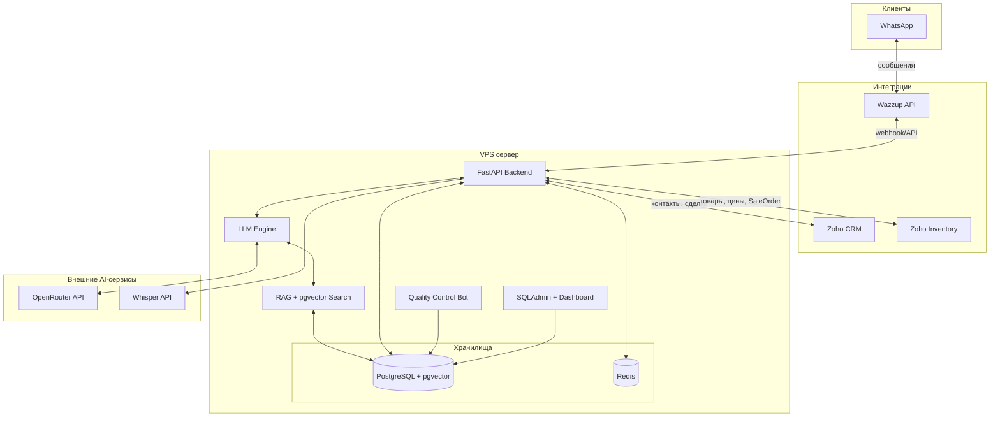
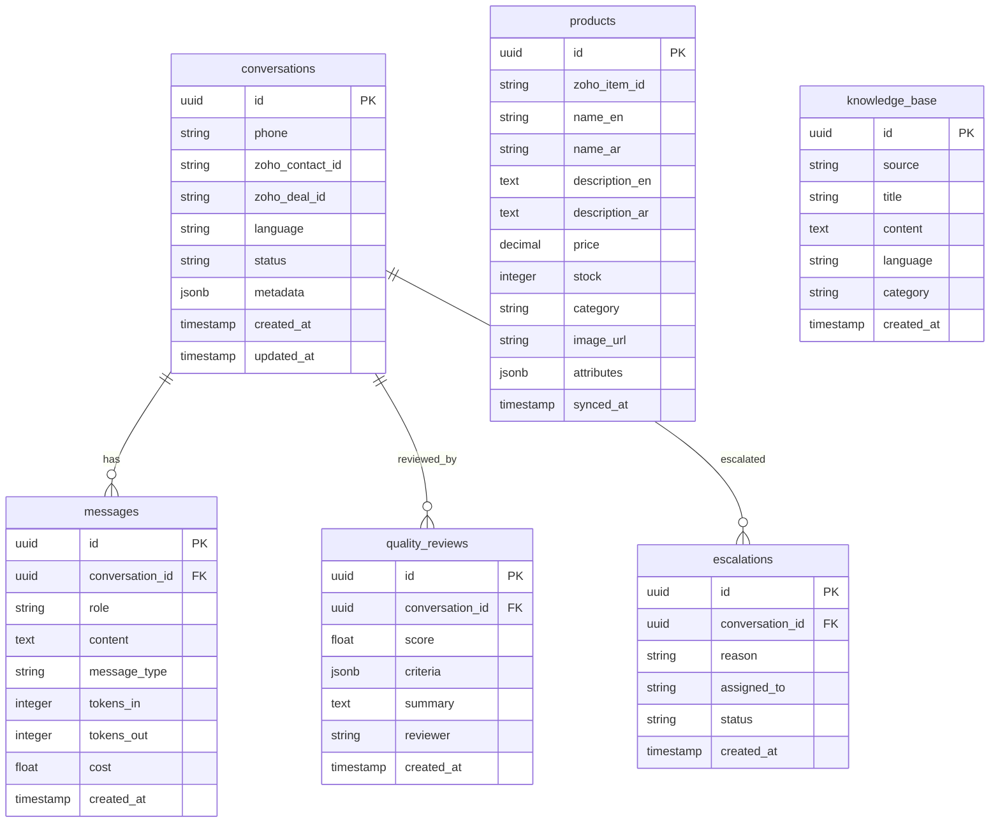
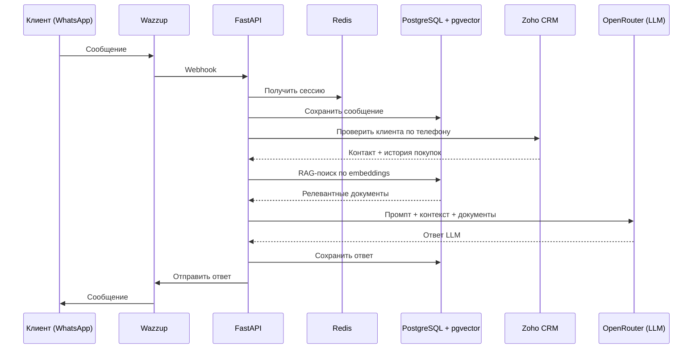
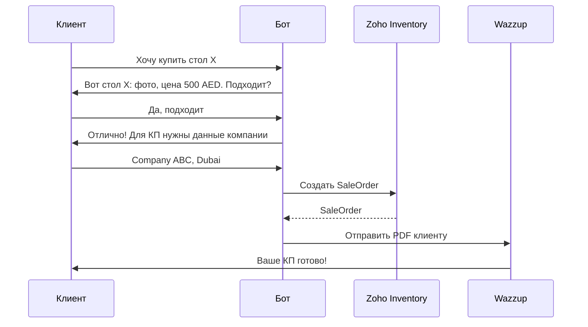

# Архитектура системы: ИИ-продавец Treejar

**Версия:** 1.0
**Дата:** 2026-02-04

---

## Общая схема


```mermaid
graph TB
    subgraph "Клиенты"
        WA[WhatsApp]
    end

    subgraph "Интеграции"
        WAZ[Wazzup API]
        ZOHO_CRM[Zoho CRM]
        ZOHO_INV[Zoho Inventory]
    end

    subgraph "VPS сервер"
        API[FastAPI Backend]
        LLM[LLM Engine]
        RAG[RAG + pgvector Search]
        QC[Quality Control Bot]
        ADMIN[SQLAdmin + Dashboard]

        subgraph "Хранилища"
            PG[(PostgreSQL + pgvector)]
            REDIS[(Redis)]
        end
    end

    subgraph "Внешние AI-сервисы"
        OR[OpenRouter API]
        WH[Whisper API]
    end

    WA <-->|сообщения| WAZ
    WAZ <-->|webhook/API| API
    API <--> LLM
    LLM <--> OR
    LLM <--> RAG
    RAG <--> PG
    API <--> PG
    API <--> REDIS
    API <-->|контакты, сделки| ZOHO_CRM
    API <-->|товары, цены, SaleOrder| ZOHO_INV
    API --> WH
    QC --> PG
    ADMIN --> PG
```

---

## Стек технологий

| Компонент | Технология | Версия | Обоснование |
|-----------|------------|--------|-------------|
| **Язык** | Python | 3.12+ | Лучшая экосистема для LLM/AI |
| **Фреймворк** | FastAPI | 0.110+ | Async, быстрый, типизированный |
| **ORM** | SQLAlchemy | 2.0+ | Стандарт для Python |
| **Миграции** | Alembic | 1.13+ | Версионирование схемы БД |
| **БД** | PostgreSQL | 16 | Надёжная, бесплатная |
| **Векторный поиск** | pgvector | PostgreSQL extension | Векторный поиск в той же БД, без отдельного сервиса |
| **Кеш/очереди** | Redis | 7+ | Сессии, rate limiting, очереди |
| **LLM** | OpenRouter / DeepSeek API | — | OpenRouter как маршрутизатор / DeepSeek прямой API |
| **Голос** | Whisper (OpenAI) | — | Распознавание EN/AR |
| **Контейнеризация** | Docker + Compose | — | Изоляция, воспроизводимость |
| **CI/CD** | GitHub Actions | — | Автодеплой из git клиента |

---

## Сервер и инфраструктура

### VPS

| Параметр | Значение |
|----------|----------|
| **CPU** | 4 ядра |
| **RAM** | 8 GB |
| **Диск** | 80 GB SSD |
| **ОС** | Ubuntu 24.04 LTS |
| **Расположение** | Европа (Германия) |
| **Провайдер** | Hetzner (Ожидается выделенный независимый VPS. Пока предоставлен рабочий: IP уточняется) |
| **Стоимость** | ~$10-15/мес (Ожидается) |

### Что запущено на сервере

```
VPS (4 CPU, 8 GB RAM, 80 GB SSD)
├── Docker Compose
│   ├── app (FastAPI + SQLAdmin + Vite SPA) — порт 8000
│   ├── postgres — порт 5432
│   ├── redis — порт 6379
│   └── nginx (reverse proxy) — порт 80/443
```

> **Примечание:** Админ-панель реализована как гибрид:
> - **SQLAdmin** (встроен в FastAPI) — operator surface для 13 runtime models, конфигурации и read-only audit tables
> - **React/Vite дашборд** (`frontend/admin/`) — аналитика, KPI и operator center поверх `/api/v1/admin/dashboard/*` и `/api/v1/admin/*`
> - `/admin/` и `/dashboard/` используют одну и ту же admin session

---

## Схема базы данных (PostgreSQL)

Ниже показан упрощённый core ERD для основных бизнес-сущностей. Полный текущий runtime/operator surface шире и включает также `ConversationSummary`, `ManagerReview`, `Feedback`, `MetricsSnapshot`, `SystemConfig`, `SystemPrompt` и `Referral`.


```mermaid
erDiagram
    conversations {
        uuid id PK
        string phone
        string zoho_contact_id
        string zoho_deal_id
        string language
        string status
        jsonb metadata
        timestamp created_at
        timestamp updated_at
    }

    messages {
        uuid id PK
        uuid conversation_id FK
        string role
        text content
        string message_type
        integer tokens_in
        integer tokens_out
        float cost
        timestamp created_at
    }

    products {
        uuid id PK
        string zoho_item_id
        string name_en
        string name_ar
        text description_en
        text description_ar
        decimal price
        integer stock
        string category
        string image_url
        jsonb attributes
        timestamp synced_at
    }

    knowledge_base {
        uuid id PK
        string source
        string title
        text content
        string language
        string category
        timestamp created_at
    }

    quality_reviews {
        uuid id PK
        uuid conversation_id FK
        float score
        jsonb criteria
        text summary
        string reviewer
        timestamp created_at
    }

    escalations {
        uuid id PK
        uuid conversation_id FK
        string reason
        string assigned_to
        string status
        timestamp created_at
    }

    conversations ||--o{ messages : has
    conversations ||--o{ quality_reviews : reviewed_by
    conversations ||--o{ escalations : escalated
```

---

## Векторный поиск (pgvector)

| Источник | Содержимое | Где хранится |
|----------|------------|--------------|
| `products.embedding` | Векторизованные описания товаров | PostgreSQL + pgvector |
| `knowledge_base.embedding` | FAQ, правила диалога, факты о компании | PostgreSQL + pgvector |

**Embedding-модель:** BGE-M3 через локальный embedding pipeline.

---

## API-архитектура

```
/api/v1/
├── /webhook/wazzup          # Входящие сообщения от Wazzup
├── /conversations/          # Управление диалогами
├── /products/               # Каталог товаров
│   ├── /search              # Поиск по каталогу (RAG)
│   └── /sync                # Protected operator endpoint for catalog sync
├── /crm/                    # Интеграция с Zoho CRM
│   ├── /contacts            # Контакты
│   └── /deals               # Сделки
├── /inventory/              # Zoho Inventory
│   ├── /stock               # Остатки
│   └── /sale-orders         # Создание SaleOrder
├── /quality/                # Контроль качества
│   └── /reviews             # Оценки диалогов
├── /notifications/          # Protected operator notification endpoints
├── /reports/                # Protected report generation endpoints
├── /referrals/              # Protected referral operations
├── /manager-reviews/        # Protected manager review API
├── /admin/                  # Админ-панель API
│   ├── /prompts             # Управление промптами
│   ├── /dashboard           # Dashboard metrics + timeseries
│   └── /settings            # Настройки
└── /health                  # Состояние сервиса
```

---

## Потоки данных

### 1. Входящее сообщение клиента


```mermaid
sequenceDiagram
    participant C as Клиент (WhatsApp)
    participant W as Wazzup
    participant A as FastAPI
    participant R as Redis
    participant P as PostgreSQL + pgvector
    participant Z as Zoho CRM
    participant L as OpenRouter (LLM)

    C->>W: Сообщение
    W->>A: Webhook
    A->>R: Получить сессию
    A->>P: Сохранить сообщение
    A->>Z: Проверить клиента по телефону
    Z-->>A: Контакт + история покупок
    A->>P: RAG-поиск по embeddings
    P-->>A: Релевантные документы
    A->>L: Промпт + контекст + документы
    L-->>A: Ответ LLM
    A->>P: Сохранить ответ
    A->>W: Отправить ответ
    W->>C: Сообщение
```

### 2. Создание КП (SaleOrder)


```mermaid
sequenceDiagram
    participant C as Клиент
    participant B as Бот
    participant ZI as Zoho Inventory
    participant W as Wazzup

    C->>B: Хочу купить стол X
    B->>C: Вот стол X: фото, цена 500 AED. Подходит?
    C->>B: Да, подходит
    B->>C: Отлично! Для КП нужны данные компании
    C->>B: Company ABC, Dubai
    B->>ZI: Создать SaleOrder
    ZI-->>B: SaleOrder #12345, PDF
    B->>W: Отправить PDF клиенту
    W->>C: Ваше КП готово!
```

---

## Безопасность

| Мера | Реализация |
|------|------------|
| **HTTPS** | Let's Encrypt, автообновление |
| **API-ключи** | Хранение в `.env`, не в коде |
| **Wazzup webhook** | Верификация подписи |
| **БД** | Пароль, только localhost |
| **SSH** | Ключи, отключён пароль |
| **Бэкапы** | PostgreSQL: ежедневно, хранение 30 дней |
| **Логирование** | Все запросы, без персональных данных в логах |

---

## Git-репозиторий клиента

Проект размещается на GitHub/GitLab аккаунте клиента:

```
treejar-ai-bot/
├── src/
│   ├── api/              # FastAPI endpoints
│   │   └── admin/        # SQLAdmin views + auth (CRUD)
│   ├── core/             # Конфигурация, зависимости
│   ├── llm/              # LLM engine, промпты
│   ├── rag/              # RAG pipeline, embeddings
│   ├── integrations/     # Wazzup, Zoho CRM, Zoho Inventory
│   ├── quality/          # Бот контроля качества
│   └── models/           # SQLAlchemy модели
├── frontend/
│   ├── landing/          # Лендинг (React/Vite/Tailwind)
│   └── admin/            # Дашборд и аналитика (React/Vite/Tailwind)
├── migrations/           # Alembic миграции
├── tests/                # Тесты
├── docker-compose.yml    # Запуск всех сервисов
├── Dockerfile            # Сборка приложения
├── .env.example          # Пример конфигурации
├── .github/workflows/    # CI/CD
└── README.md             # Документация
```

**Права доступа:** Клиент — Owner, Исполнитель — Collaborator (на время разработки).

---

## Масштабирование (при росте нагрузки)

| Нагрузка | Решение |
|----------|---------|
| До 200 диал/день | Текущий VPS (4 CPU, 8 GB) |
| 200-1000 диал/день | Увеличить VPS до 8 CPU, 16 GB |
| 1000+ диал/день | Вынести PostgreSQL/pgvector и Redis на отдельные managed или выделенные ресурсы |
