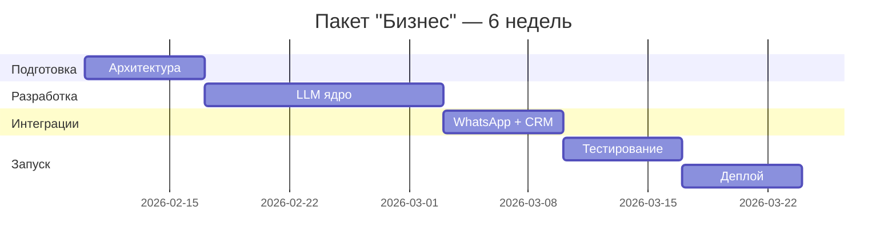

# План: Заполнение CSV клиента (часы, стоимость, спринты)

## Задача
Заполнить в файле `docs/Проект Виктор  - Лист1.csv` три колонки:
1. **Часы разработки** — на основе оффера `docs/estimate.md`
2. **Стоимость** — часы × 1 500 ₽/ч
3. **Спринты (понедельно)** — распределение по неделям

Правила:
- Заполнять только строки, где клиент указал "Что является результатом"
- Добавить отдельными строками критичные модули (Архитектура, LLM ядро, Тестирование, Деплой)
- Реферальная система — два варианта (24ч / 32ч)

---

## Файл для изменения
- `docs/Проект Виктор  - Лист1.csv`

## Источник данных
- `docs/estimate.md` (оффер, ставка 1 500 ₽/ч)

---

## Данные для заполнения

### Строки с результатом от клиента

| Модуль CSV | Модуль оффера | Часы | Стоимость | Спринт |
|---|---|---|---|---|
| База знаний | База знаний | 40 | 60 000 ₽ | Неделя 2-3 |
| Интеграция с WhatsApp | WhatsApp (Wazzup) | 20 | 30 000 ₽ | Неделя 3 |
| Интеграция с Zoho CRM | CRM базовый (24) + расширенный (16) | 40 | 60 000 ₽ | Неделя 4-5 |
| Проверка остатков | Zoho Inventory | 16 | 24 000 ₽ | Неделя 5 |
| Генерация КП в PDF | Генерация КП | 16 | 24 000 ₽ | Неделя 5 |
| Индивидуальные цены | Персонализация | 20 | 30 000 ₽ | Неделя 6 |
| Передача диалога | Эскалация | 12 | 18 000 ₽ | Неделя 6 |
| Админ-панель | Базовая админка | 32 | 48 000 ₽ | Неделя 7 |
| Бот контроля качества | Бот контроля качества | 32 | 48 000 ₽ | Неделя 9-10 |
| Оценка менеджеров | Оценка менеджеров | 24 | 36 000 ₽ | Неделя 10-11 |
| Уведомления Telegram | Уведомления | 8 | 12 000 ₽ | Неделя 11 |
| Отчёты по отказам | Отчёты по боту | 20 | 30 000 ₽ | Неделя 11 |
| Рекомендательная система | Рекомендации | 24 | 36 000 ₽ | Неделя 12 |
| Реферальная система | НОВОЕ (вариант 1 / вариант 2) | 24 / 32 | 36 000 / 48 000 ₽ | Неделя 12-13 |
| **Подитог** | | **304** | **456 000 ₽** | |

### Критичные модули (новые строки)

| Модуль | Часы | Стоимость | Спринт | Обоснование |
|---|---|---|---|---|
| Архитектура | 24 | 36 000 ₽ | Неделя 1 | Проектирование системы, схема БД — без этого нельзя начать |
| LLM ядро (EN/AR) | 32 | 48 000 ₽ | Неделя 2-3 | Мозг бота: генерация ответов, мультиязычность |
| Тестирование (этап 1) | 24 | 36 000 ₽ | Неделя 8 | Функциональные и интеграционные тесты |
| Тестирование (этап 2) | 24 | 36 000 ₽ | Неделя 13 | E2E тесты второго этапа |
| Деплой | 12 | 18 000 ₽ | Неделя 8 | Настройка VPS, запуск в production |
| **Подитог** | **116** | **174 000 ₽** | | |

### Без результата (не заполняем)

| Модуль | Часы оффера | Причина |
|---|---|---|
| Ответы на вопросы (EN/AR) | 32 | Нет результата (но покрыто LLM ядром выше) |
| Понимание голосовых | 16 | Нет результата |
| Дашборды и графики | 32 | Нет результата |
| Обучение команды и докс | 20 | Нет результата |

---

## Итоговые суммы

| Вариант | Часы | Стоимость |
|---|---|---|
| Модули + критичные (без реферальной) | 420 | **630 000 ₽** |
| + Реферальная (вариант 1: базовая) | 444 | **666 000 ₽** |
| + Реферальная (вариант 2: с админкой) | 452 | **678 000 ₽** |
| Для сравнения: оффер "Профи" | 392 | 588 000 ₽ |
| Для сравнения: оффер "Премиум" | 512 | 768 000 ₽ |

---

## Спринты (понедельно)

### Этап 1: Базовая автоматизация + Продажи (недели 1-8)

| Неделя | Модули | Часов |
|--------|--------|-------|
| 1 | Архитектура | 24 |
| 2-3 | База знаний + LLM ядро | 72 |
| 3 | Интеграция WhatsApp | 20 |
| 4-5 | Интеграция Zoho CRM + Проверка остатков | 56 |
| 5 | Генерация КП в PDF | 16 |
| 6 | Индивидуальные цены + Передача диалога | 32 |
| 7 | Админ-панель | 32 |
| 8 | Тестирование этап 1 + Деплой | 36 |

### Этап 2: Контроль и аналитика (недели 9-13)

| Неделя | Модули | Часов |
|--------|--------|-------|
| 9-10 | Бот контроля качества | 32 |
| 10-11 | Оценка менеджеров | 24 |
| 11 | Уведомления + Отчёты по отказам | 28 |
| 12 | Рекомендательная + Реферальная (начало) | 48/56 |
| 13 | Реферальная (конец) + Тестирование этап 2 | 24 |

---

## Верификация
- [ ] Все строки с результатом заполнены (часы, стоимость, спринт)
- [ ] Критичные модули добавлены отдельными строками
- [ ] Реферальная система — оба варианта
- [ ] Итоговые суммы корректны (часы × 1500)
- [ ] Спринты совпадают с этапами клиента (первый/второй)
- [ ] CSV открывается в Google Sheets без ошибок

---

## Прежний план (скилл generate-estimate)

> Остаётся в бэклоге — ниже сохранён для будущей реализации.

---

## Анализ: Что должно входить в КП

### Обязательные секции

| Секция | Описание | Бизнес-ценность |
|--------|----------|-----------------|
| **О проекте** | Краткое описание, цели | Клиент сразу понимает контекст |
| **Пакеты услуг** | 3-4 уровня (Старт → Премиум) | Выбор под бюджет и потребности |
| **Модули и часы** | Таблица работ с оценкой | Прозрачность ценообразования |
| **Бизнес-выгоды** | Продающий текст для каждого пакета | Обоснование ценности |
| **Сравнительная таблица** | Что входит в какой пакет | Быстрое сравнение |
| **Дополнительные опции** | Докупаемые модули | Upsell |
| **Ежемесячные расходы** | Инфраструктура, API, SaaS | Полная картина затрат |
| **Итоговая таблица** | Пакет / Часы / Цена / Срок | Быстрое принятие решения |
| **Рекомендация** | Какой пакет выбрать | Экспертное мнение |
| **Что не входит** | Ограничения, зона ответственности | Управление ожиданиями |
| **Гарантии** | Поддержка, исправление багов | Снижение рисков |
| **Следующие шаги** | Call-to-action | Конверсия в сделку |

| **Команда проекта** | Кто работает, роли, часы | Прозрачность и доверие |

### Опциональные секции (для расширенных КП)

| Секция | Когда нужна |
|--------|-------------|
| **Возможности развития** | Долгосрочные проекты, продажа roadmap |
| **ROI-калькулятор** | Дорогие проекты, нужно обосновать инвестицию |
| **Риски и митигация** | Сложные интеграции, enterprise-клиенты |
| **Timeline / Gantt** | Проекты с жёсткими дедлайнами |
| **Кейсы / Портфолио** | Новый клиент, нужно доверие |
| **Сравнение с альтернативами** | Конкурентный рынок |

---

## Архитектура скилла

### Входные параметры (JSON)

```json
{
  "project": {
    "name": "ИИ-продавец для Treejar",
    "description": "Автоматизация продаж офисной мебели через WhatsApp",
    "client": "Treejar",
    "date": "2026-02-03"
  },
  "packages": [
    {
      "name": "Старт",
      "subtitle": "базовая автоматизация",
      "modules": [
        {"name": "Архитектура", "description": "Проектирование системы", "hours": 24},
        {"name": "WhatsApp", "description": "Приём и отправка сообщений", "hours": 20}
      ],
      "result": "Бот отвечает на вопросы о товарах",
      "benefits": [
        {"title": "24/7 работа", "description": "клиенты получают ответы ночью"},
        {"title": "Мгновенный отклик", "description": "время ответа <5 секунд"}
      ],
      "limitations": [],
      "payback": "2-3 месяца при 20 обращений/день"
    }
  ],
  "team": [
    {
      "role": "Архитектор / Tech Lead",
      "name": "Игорь М.",
      "responsibilities": ["Проектирование", "Code Review", "Интеграции"],
      "hours": 60,
      "rate": 2500
    },
    {
      "role": "Backend-разработчик",
      "name": "Senior",
      "responsibilities": ["LLM ядро", "API", "База данных"],
      "hours": 120,
      "rate": 1500
    },
    {
      "role": "DevOps",
      "name": "Middle",
      "responsibilities": ["Деплой", "CI/CD", "Мониторинг"],
      "hours": 20,
      "rate": 1500
    }
  ],
  "defaultHourlyRate": 1500,
  "currency": "₽",
  "monthlyExpenses": {
    "infrastructure": [
      {"name": "VPS", "cost": "2000-4000", "note": "С запасом на рост"}
    ],
    "llm": [
      {"model": "DeepSeek V3.2", "priceIn": 0.28, "priceOut": 0.42}
    ]
  },
  "addons": [
    {"name": "Telegram-бот", "hours": 20, "description": "Уведомления для менеджеров"}
  ],
  "excludes": ["Настройка CRM", "Подготовка контента"],
  "guarantees": ["30 дней исправление багов", "Передача исходников"],
  "nextSteps": ["Выбор пакета", "Созвон для деталей", "Подписание договора"],
  "recommendation": {
    "package": "Бизнес",
    "reasons": ["Полный цикл продажи", "Голосовые сообщения"]
  },
  "validity": 14,
  "options": {
    "includeFutureDevelopment": true,
    "includeRoi": false,
    "includeRisks": true,
    "includeTimeline": true
  },
  "lang": "ru"
}
```

### Выходной формат

Markdown-документ со всеми секциями, готовый к отправке клиенту.

---

## Структура файлов скилла

```
.claude/skills/generate-estimate/
├── SKILL.md              # Основной файл скилла
├── templates/
│   ├── estimate.md       # Шаблон КП
│   ├── package.md        # Шаблон описания пакета
│   └── benefits.md       # Шаблон бизнес-выгод
├── data/
│   ├── benefit-templates.json   # Готовые формулировки выгод
│   ├── limitation-templates.json # Формулировки ограничений
│   └── llm-models.json          # Актуальные модели и цены
└── examples/
    ├── ai-sales-bot.json        # Пример входных данных (Treejar)
    └── ai-sales-bot.md          # Результат генерации
```

---

## Пошаговая инструкция (Instructions в SKILL.md)

### Step 1: Собрать информацию о проекте
- Название, описание, клиент
- Основные цели и задачи

### Step 2: Определить модули и оценить часы
- Разбить на логические блоки
- Оценить трудозатраты

### Step 3: Сформировать пакеты
- Базовый → Продвинутый → Премиум
- Каждый следующий включает предыдущий + новое

### Step 4: Написать бизнес-выгоды
- Для каждого пакета: 4-5 выгод с описанием
- Использовать шаблоны из `benefit-templates.json`
- Добавить "Идеально для:" или "Окупаемость:"

### Step 5: Рассчитать стоимость
- Часы × Ставка = Стоимость
- Ежемесячные расходы (инфра + LLM + SaaS)

### Step 6: Сгенерировать сравнительную таблицу
- Галочки для каждой функции по пакетам

### Step 7: Добавить дополнительные секции
- Опции, исключения, гарантии, следующие шаги
- Опционально: развитие, ROI, риски

### Step 8: Сформировать рекомендацию
- Какой пакет лучше для этого клиента и почему

---

## Пример секции "Команда проекта" (output)

```markdown
## Команда проекта

| Роль | Зона ответственности | Часы | Ставка | Сумма |
|------|---------------------|------|--------|-------|
| **Архитектор / Tech Lead** | Проектирование, Code Review, Интеграции | 60 ч | 2 500 ₽/ч | 150 000 ₽ |
| **Backend-разработчик** | LLM ядро, API, База данных | 120 ч | 1 500 ₽/ч | 180 000 ₽ |
| **DevOps** | Деплой, CI/CD, Мониторинг | 20 ч | 1 500 ₽/ч | 30 000 ₽ |
| **QA** | Тестирование, Приёмка | 16 ч | 1 200 ₽/ч | 19 200 ₽ |
| **Итого** | | **216 ч** | | **379 200 ₽** |

**Почему это важно:**
- Вы знаете, кто отвечает за каждую часть проекта
- Прозрачное ценообразование — видно, за что платите
- Опытная команда = меньше рисков и переделок
```

---

## Шаблоны бизнес-выгод (benefit-templates.json)

```json
{
  "24/7": {
    "title": "Работает 24/7",
    "templates": [
      "клиенты получают ответы ночью, в выходные и праздники",
      "не пропускает обращения даже когда офис закрыт",
      "работает без выходных и больничных"
    ]
  },
  "speed": {
    "title": "Мгновенный отклик",
    "templates": [
      "среднее время ответа <5 секунд вместо часов ожидания",
      "клиент получает информацию пока 'горячий'",
      "не теряет интерес из-за долгого ожидания"
    ]
  },
  "scalability": {
    "title": "Масштабируемость",
    "templates": [
      "обрабатывает 100+ диалогов одновременно",
      "растёт вместе с бизнесом без найма новых сотрудников",
      "справляется с пиковыми нагрузками"
    ]
  },
  "conversion": {
    "title": "Рост конверсии",
    "templates": [
      "персонализация увеличивает закрытие сделок на 15-25%",
      "не упускает клиентов из-за человеческого фактора",
      "дожимает сделки автоматическими follow-up"
    ]
  },
  "analytics": {
    "title": "Данные = деньги",
    "templates": [
      "видите, какие товары спрашивают, но не покупают",
      "понимаете причины отказов и корректируете стратегию",
      "принимаете решения на основе данных, а не интуиции"
    ]
  },
  "quality": {
    "title": "Контроль качества",
    "templates": [
      "система сама находит проблемные диалоги",
      "объективные метрики без ручного аудита",
      "ловите проблемы до жалоб клиентов"
    ]
  }
}
```

---

## Файлы для создания

| Файл | Назначение |
|------|------------|
| `SKILL.md` | Основной файл скилла с инструкциями |
| `templates/estimate.md` | Шаблон КП с переменными |
| `templates/timeline.md` | Шаблон секции Timeline + Mermaid |
| `templates/risks.md` | Шаблон секции рисков |
| `data/benefit-templates.json` | Готовые формулировки бизнес-выгод |
| `data/team-roles.json` | Роли команды и ставки по умолчанию |
| `data/llm-models.json` | Актуальные модели LLM и цены |
| `data/risk-templates.json` | Типовые риски для IT-проектов |
| `examples/ai-sales-bot.json` | Пример входных данных (Treejar) |

**Путь:** `.claude/skills/generate-estimate/`

---

## Верификация

- [ ] Скилл генерирует валидный Markdown
- [ ] Все обязательные секции присутствуют
- [ ] Расчёты стоимости корректны (часы × ставка)
- [ ] Бизнес-выгоды читаются как продающий текст
- [ ] Сравнительная таблица выровнена
- [ ] Пример из Treejar воспроизводится корректно

---

## Решения по архитектуре

| Вопрос | Решение |
|--------|---------|
| **Язык** | Русский по умолчанию, английский опционально через параметр `lang: "en"` |
| **Ставки** | Конфиг `team-roles.json` по умолчанию, можно переопределить в параметрах |
| **Секции по умолчанию** | Возможности развития, Риски и митигация, Timeline |
| **Валюта** | Параметр `currency`, по умолчанию "₽" |

---

## Пример секции "Timeline" (output)

```markdown
## Timeline проекта

| Этап | Недели | Результат |
|------|--------|-----------|
| **Архитектура и дизайн** | 1 | Техническое задание, схема БД |
| **Разработка ядра** | 2-3 | LLM интеграция, база знаний |
| **Интеграции** | 4 | WhatsApp, CRM, Inventory |
| **Тестирование** | 5 | Функциональные и интеграционные тесты |
| **Деплой и обучение** | 6 | Запуск в production |


```

---

## Пример секции "Риски" (output)

```markdown
## Риски и митигация

| Риск | Вероятность | Влияние | Митигация |
|------|-------------|---------|-----------|
| Изменение API Wazzup | Средняя | Высокое | Абстракция интеграции, быстрый рефакторинг |
| Качество ответов LLM | Низкая | Среднее | A/B тестирование промптов, человеческий fallback |
| Перегрузка при пиках | Низкая | Высокое | Автоскейлинг, очереди сообщений |
| Задержки согласования | Высокая | Среднее | Регулярные демо, асинхронная коммуникация |

**Общий уровень риска:** 🟢 Низкий — стандартный проект с проверенным стеком
```
