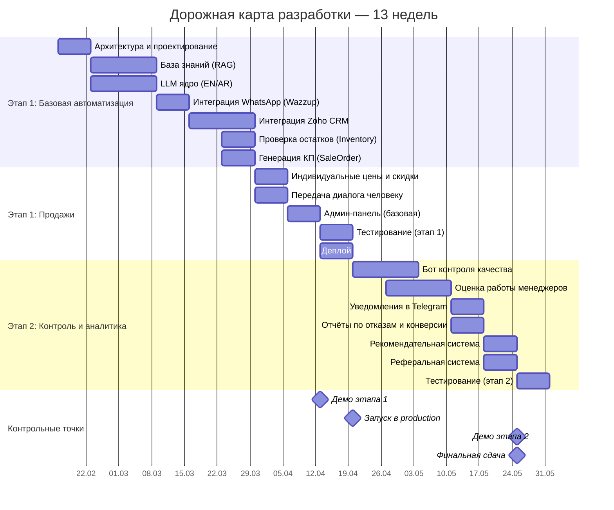

# Дорожная карта разработки: ИИ-продавец Treejar

**Версия:** 1.0
**Дата:** 2026-02-04
**Общий срок:** 13 недель (2 этапа)

---

## Визуализация

---

## Понедельный план

### Этап 1: Базовая автоматизация + Продажи (недели 1-8)

| Неделя | Даты | Модули | Часов | Результат |
|--------|------|--------|-------|-----------|
| **1** | 16-20 фев | Архитектура и проектирование | 24 | Схема БД, API-контракты, настройка репозитория |
| **2** | 23-27 фев | База знаний + LLM ядро (начало) | 40 | Коннекторы Zoho Inventory, сайты, RAG pipeline |
| **3** | 2-6 мар | LLM ядро (конец) + WhatsApp | 32 | Бот отвечает в WhatsApp на тестовые вопросы |
| **4** | 9-13 мар | Zoho CRM (начало) + Проверка остатков | 36 | Определение клиента по телефону, остатки |
| **5** | 16-20 мар | Zoho CRM (конец) + Генерация КП | 36 | SaleOrder в Zoho, отправка PDF в чат |
| **6** | 23-27 мар | Индивидуальные цены + Передача диалога | 32 | Персональные цены, эскалация на менеджера |
| **7** | 30 мар - 3 апр | Админ-панель (базовая) | 32 | Просмотр диалогов, редактирование промптов |
| **8** | 6-10 апр | Тестирование + Деплой | 36 | Запуск на VPS клиента |

**Контрольная точка: Демо этапа 1 (10 апреля)**
- Бот работает в WhatsApp
- Отвечает на вопросы по каталогу (EN/AR)
- Создаёт сделки в CRM
- Генерирует КП
- Админ-панель доступна

---

### Этап 2: Контроль и аналитика (недели 9-13)

| Неделя | Даты | Модули | Часов | Результат |
|--------|------|--------|-------|-----------|
| **9** | 13-17 апр | Бот контроля качества (начало) | 20 | Методология оценки, критерии качества |
| **10** | 20-24 апр | Бот контроля (конец) + Оценка менеджеров (начало) | 36 | Автоматическая оценка диалогов |
| **11** | 27 апр - 1 мая | Оценка менеджеров (конец) + Уведомления + Отчёты | 28 | Еженедельные отчёты, алерты в Telegram |
| **12** | 4-8 мая | Рекомендательная + Реферальная система | 48 | Рекомендации товаров, бонусы для клиентов |
| **13** | 11-15 мая | Тестирование этапа 2 | 24 | E2E тесты, финальная приёмка |

**Контрольная точка: Финальная сдача (15 мая)**
- Контроль качества работает автоматически
- Еженедельные отчёты отправляются
- Уведомления в Telegram настроены
- Все модули протестированы

---

## Этапы оплаты (привязка к результатам)

| Этап | Когда | Что сдано | Сумма |
|------|-------|-----------|-------|
| **Предоплата** | До старта | — | 150 000 ₽ |
| **Этап 1a** | Неделя 3 | Бот отвечает в WhatsApp (демо) | 150 000 ₽ |
| **Этап 1b** | Неделя 8 | Полный этап 1 (КП, CRM, админка, деплой) | 150 000 ₽ |
| **Этап 2** | Неделя 13 | Контроль, отчёты, финальная сдача | 150 000 ₽ |
| **Премия за сроки** | При финальной сдаче | Все этапы сданы в срок | +100 000 ₽ |
| **Итого** | | | **600 000 — 700 000 ₽** |

---

## Риски и митигация

| Риск | Вероятность | Влияние | Митигация |
|------|-------------|---------|-----------|
| Задержки согласования от клиента | Высокая | Среднее | Еженедельные демо, асинхронная коммуникация |
| Изменение API Wazzup/Zoho | Средняя | Высокое | Абстракция интеграций, быстрый рефакторинг |
| Качество ответов LLM на арабском | Средняя | Среднее | Тестирование с носителями, fallback на English |
| Перегрузка при пиках | Низкая | Высокое | Rate limiting, очереди Redis |

---

## Коммуникация

| Канал | Частота | Содержание |
|-------|---------|------------|
| Еженедельное демо | 1 раз/нед | Показ прогресса, обратная связь |
| Telegram-чат | По необходимости | Оперативные вопросы |
| Git-коммиты | Ежедневно | Прогресс в коде |
| Отчёт по этапу | После каждого этапа | Что сделано, что дальше |
